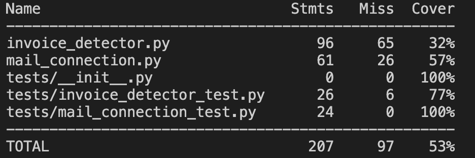

# Mail attachments (+ invoice detector)

## Overview
The main goal of the script is to get access to all the email messages from selected month, retrieve selected attachments (PDF files) and detect whether the PDF file is an invoice or not.

## Modules
### mail_connection.py
It is a module that provides EmailConnector class and its functionality to connect to certain email account and retrieve email messages with their attachments.

### invoice_detector.py
Module provides InvoiceDetection class which is responsible for converting PDF files to images and using OCR algorithms to extract the text from a PDF file and then search for given data in it. 

### window.py
Window module provides a simple User Interface which enables user to insert the credentials to access the email account and select the month to fetch the messages from.

## Usage
First configure the server type and put it in the .env file (see .env.example). 
You can also define REQUIRED_FILE_EXTENSION which stands for filtering retrieved files by their extension type. (PDF by default).
Moreover, to specify which word are you looking for in a PDF file, adjust BROWSED_DATA env variable.

Then you're ready to go, open your terminal and run the following:
```
### Setup virtual environment and install all the requirements
$ python3 -m venv venv
$ source venv/bin/activate
(venv) $ pip install -r requirements.txt

### Run the main script
$ python3 main.py
```

You should see the window asking for your email credentials. Try it out!

The script should retrieve all the attachments from your email from given month. Then it puts all the retrieved files in `attachments/` catalogue. Then it is trying to detect whether browsed string is present in any of the PDF files. If so, the detected files are being moved to `attachments/detected/` directory

## Tests
There are some test present in this project. To run those, go to the terminal and insert
```
$ pytest
```

Here's the tests coverage at the moment:



## Performance tests
First version of the `invoice_detector` module used the method called `detect_data_from_pdf` which initially executed operations on files one by one. 
It took around 64 seconds to process 15 files.

To improve this process I've decided to use multiprocessing approach as this is strictly related to CPU usage. Then thanks to implemented method called `multiprocessing_detect_data_from_pdf` the script worked on 15 files for 22 seconds which is (66% less!). 

To check the performance locally you can run just invoice_detector module once you have your PDF files in attachments/ directory. The module still contains functions checking the performance of both methods.